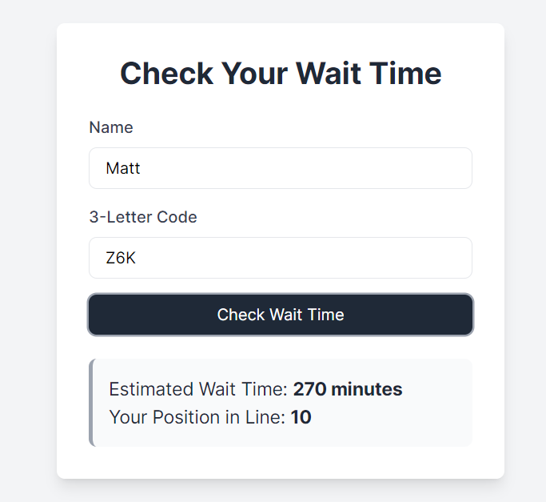

# Emergency Hospital Waitlist

This project is an emergency hospital waitlist management system. It consists of a server that provides an API and a client for user interaction.

## Hosted Project

This projects database is hosted on AWS RDS, the REST API is hosted on Heroku, and the Next app is hosted on Vercel for your ease of correction
You may visit this at https://emergency-waitlist.vercel.app/

Likewise, a copy my portfolio containing the projects from this class is availible at https://sam-harri.github.io/csi3140_portfolio/ 

## Running the Project Locally

### Clone the Repository

```bash
git clone https://github.com/sam-harri/emergency_waitlist
```

### Running the Server

1. Navigate to the server directory:
    ```bash
    cd server
    ```
2. Create a `.env` file at the root of the server directory with the following content:
    ```plaintext
    POSTGRES_DATABASE=
    POSTGRES_PORT=
    POSTGRES_PASSWORD=
    POSTGRES_HOST=
    ```
3. Install server dependencies:
    ```bash
    pip install -r requirements.txt
    ```
4. Start the server:
    ```bash
    python3 -m main
    ```
    This will start the API on port `8080`.


### Running the Client

1. Navigate to the client directory:
    ```bash
    cd ../emergencyclient
    ```
2. Install client dependencies:
    ```bash
    npm install
    ```
3. Start the client:
    ```bash
    npm run dev
    ```
    This will serve the client on `localhost:3000`.

**Note:** Ensure that the Axios instance at the root of the `src` directory in the client points to the correct `baseURL`.

## How It Works

### Admin Dashboard

The admin dashboard provides an overview of:

- Everyone in the waitlist
- Everyone currently getting treated
- The 10 most recent people who have been served

Each person listed has a button in their table row to move them to the next section.


### Adding a New Patient

The admin can add a new patient by providing their name and the severity of their injury. Upon submission, the system returns a 3-letter code for the patient, which includes:

- Estimated wait time
- Patient's position in the waitlist


### Patient Section

Patients can enter their name and 3-letter code to receive an estimate of their wait time and their current position in the waitlist.


